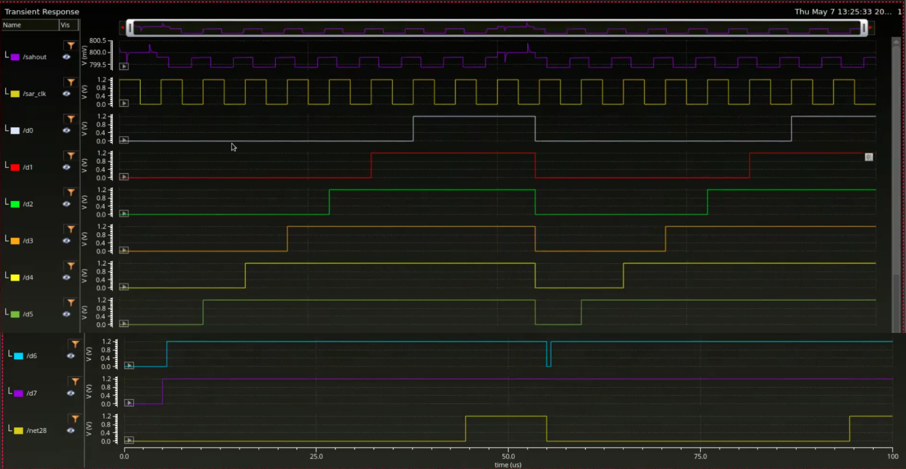
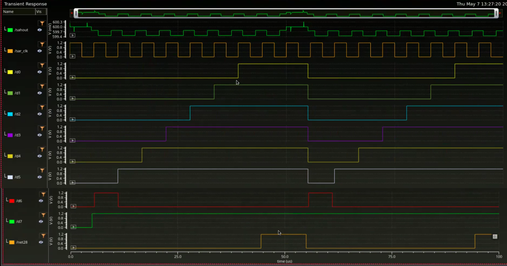
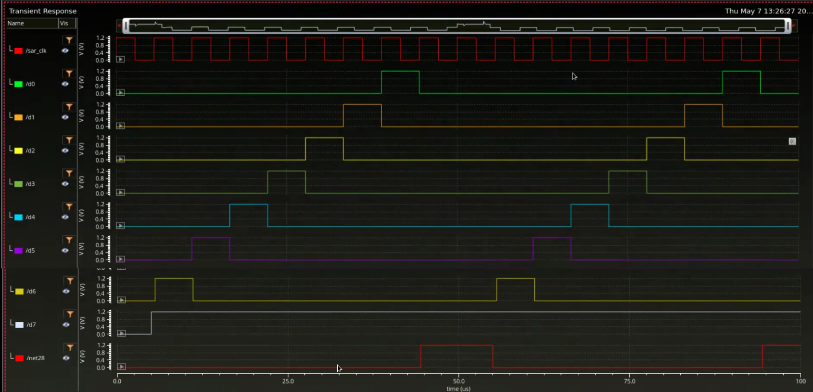
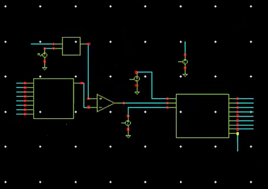
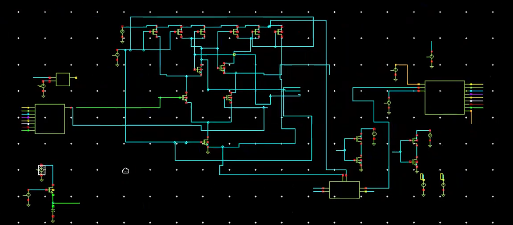

# 8-bit Charge Redistribution SAR ADC using Cadence Virtuoso

## Overview
This project presents the design and simulation of an 8-bit Charge Redistribution Successive Approximation Register (SAR) ADC using Cadence Virtuoso. The project combines analog and digital design methodologies by implementing transistor-level Sample and Hold and Comparator circuits, while SAR logic and DAC were designed using Verilog HDL.

---

## Specifications

| Parameter | Value |
|----------|------|
| Resolution | 8-bit |
| Architecture | Charge Redistribution SAR ADC |
| Input Range | 0 – 0.8 V |
| DAC Type | Capacitive DAC |
| Logic Design | Verilog HDL |
| Platform | Cadence Virtuoso |

---

## SAR ADC Architecture

A Successive Approximation Register (SAR) ADC converts an analog input signal into its digital equivalent using a binary search algorithm. The conversion process starts from the MSB and proceeds towards the LSB through comparator decisions and DAC voltage updates.

The SAR ADC architecture consists of:
- Sample and Hold Circuit  
- Comparator  
- SAR Logic  
- Capacitive DAC  

---

## Sample and Hold Circuit

The Sample and Hold circuit was implemented at transistor level to sample and hold the analog input during conversion.

### Functions
- Samples the analog input signal  
- Holds the sampled voltage constant during conversion  
- Reduces signal variation during SAR operation  

---

## Capacitive DAC

The DAC was implemented using Verilog HDL based on charge redistribution technique.

### Features
- Charge redistribution architecture  
- Binary weighted capacitor switching  
- Low power operation  

---

## Comparator

The comparator was implemented at transistor level for analog voltage comparison during SAR conversion.

### Functions
- Compares Vin and Vdac  
- Generates comparator decision output  
- Supports successive approximation operation  

---

## SAR Logic

The SAR control logic was implemented using Verilog HDL for successive approximation operation.

### Operation
- Sets trial bits  
- Reads comparator outputs  
- Updates DAC control signals  
- Generates final digital output code  

---

## Theoretical Calculations

For an 8-bit SAR ADC:

LSB = Vref / 2^8 = 0.8 / 256 = 3.125 mV  

Digital Output (D) = (Vin / Vref) × 255  

---

### Case 1: Vin = 0.8 V
- Full-scale input (Vin = Vref)  
- Decimal Output = 255  
- Binary Output = 11111111  

---

### Case 2: Vin = 0.6 V
- Decimal Output = 191  
- Binary Output = 10111111  

---

### Case 3: Vin = 0.4 V
- Decimal Output = 128  
- Binary Output = 10000000  

---

## Simulation Results

The following waveforms verify correct 8-bit SAR ADC operation using charge redistribution DAC.

---

### Vin = 0.8 V (Full Scale)

- Output: 11111111  
- Decimal: 255  
- Full-scale conversion verified  

---

### Vin = 0.6 V

- Output: 10111111  
- Decimal: 191  
- Correct SAR approximation observed  

---

### Vin = 0.4 V

- Output: 10000000  
- Decimal: 128  
- Mid-scale conversion verified  

---

## Key Observations

- Correct 8-bit SAR operation verified using charge redistribution DAC  
- Full-scale output (11111111) achieved at Vin = Vref  
- Proper monotonic behavior observed across all input levels  
- No missing codes observed in simulation  

---

---

---

## Tools Used

- Cadence Virtuoso  
- Verilog HDL  
- Spectre Simulator  

---

## Repository Structure
